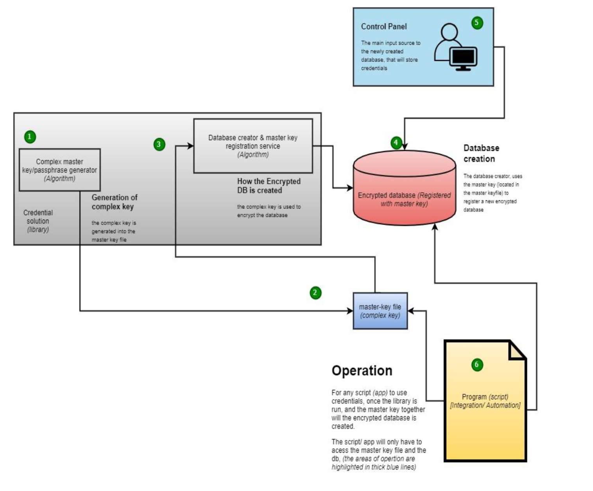

# Hud’s Password Manager (CLI) v.1.0
[SOLVE THE MAJOR PROBLEM OF STORING SCRIPT SECRETS, CREDENTIALS & API KEYS ON SERVERS]



## Application Overview
Hud’s Password Manager for Automations is a command-line interface (CLI) application designed to store and manage credentials securely. The application accepts and stores the following fields as inputs:
- Organization
- Repository
- Username (required)
- Password (required)
- Database

These fields are defaults and can be modified by remapping them in `mapper.py`. The application provides a CLI interface for users to input and view stored data, which is stored in an encrypted database.

## Architecture and System Design
The application operates based on a configuration file, which serves as the sole controller. This configuration file can be created manually or generated automatically by the application with the necessary parameters.

### Configuration File Parameters
- `name_of_database`: The name of the encrypted database (default: `cape_db.kdb`).
- `system_path`: Optionally specify the database path.
- `use_encryption_key`: Specifies whether to use an encryption key or a passphrase (password) (default: `True`).
- `master_key_size`: The size of the key if `use_encryption_key` is `True` (default: `10246`).
- `master_key_file_name`: The name of the master key if `use_encryption_key` is `True` (default: `cape_master-key.key`).
- `master_pass_file_name`: The name of the master pass if `use_encryption_key` is `False` (default: `cape_master-pass.ini`).

**Note**: The directory `.huds_mngnt_vault` contains a log file, the default location of the encrypted database, and the key/passphrase. This directory can be optionally specified under `system_path`, with the default naming being `.huds_mngnt_vault`.

## Steps to Use the Application

### Step 1: Create a New Configuration File
To start using the application, create a new `.ini` file. This can be done by running the following command:
```bash
python -B _initialize.py -c .huds_mngnt_vault/cape.ini
```

### Step 2: View Initialized Files
To view the initialized files, run the following command:
```bash
ls .huds_mngnt_vault | grep -iE '^cape*'
```

### Step 3: Log into the Database
To log into a particular database, run the following command:
```bash
python -B control_panel_.py -c .huds_mngnt_vault/cape.ini
```
**Note**: Multiple `.ini` files can be initialized, each with its respective database and key/passphrase. To log into a specific database, use the corresponding `.ini` file.

### Step 4: Command Line Interface (CLI) Actions
After logging in, follow the CLI prompt to perform the following actions:

#### Option 0: View Stored Credentials
- Displays the stored usernames (passwords are not displayed by default).
- This can be reconfigured to not display usernames as well.

#### Option 1: Input Data
- Input credentials (username, password, API keys) into the system.
- These credentials will be stored in an encrypted database.

#### Option 2: Delete Credentials
- View stored credentials using Option 0.
- Select the credential to be deleted by entering the associated organization.
- The organization field acts as a key for the credential.

## Summary
Hud’s Password Manager is a robust CLI application designed to securely manage credentials in an encrypted database. By following the steps outlined above, users can effectively store, view, and delete credentials through a simple command-line interface. The configuration file allows for flexibility and customization of the application’s settings, ensuring secure and efficient credential management.
