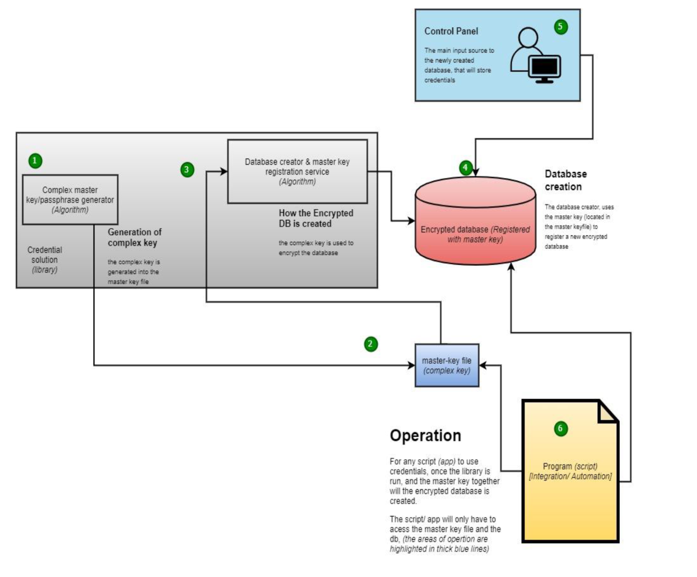

## Thesis Documentation: Hud's Password Manager (CLI) v1.0

### Abstract

Hud's Password Manager (CLI) v1.0 addresses the critical issue of storing script secrets, credentials, and API keys securely on servers. This tool provides an encrypted database solution managed through a control panel, ensuring robust security for sensitive information in production environments. The following documentation outlines the design, implementation, and operational processes of Hud's Password Manager.

### Table of Contents

1. [Introduction](#1-introduction)
   - [Problem Statement](#problem-statement)
   - [Objectives](#objectives)
2. [System Architecture](#2-system-architecture)
   - [Overview](#overview)
   - [Components](#components)
3. [Design and Implementation](#3-design-and-implementation)
   - [Master Key/Passphrase Generation](#master-keypassphrase-generation)
   - [Database Creation and Encryption](#database-creation-and-encryption)
   - [Control Panel Interface](#control-panel-interface)
   - [Operation of Scripts/Apps](#operation-of-scriptsapps)
4. [Security Considerations](#4-security-considerations)
   - [Encryption Algorithms](#encryption-algorithms)
   - [Key Management](#key-management)
   - [Access Control](#access-control)
5. [Use Cases](#5-use-cases)
   - [Typical Workflow](#typical-workflow)
   - [Integration with Existing Systems](#integration-with-existing-systems)
6. [Steps to Use the Application](#6-steps-to-use-the-application)
   - [Creating a New Configuration File](#creating-a-new-configuration-file)
   - [Viewing Initialized Files](#viewing-initialized-files)
   - [Logging into the Database](#logging-into-the-database)
   - [CLI Actions](#cli-actions)
7. [Conclusion](#7-conclusion)
   - [Summary](#summary)
   - [Future Work](#future-work)
8. [References](#8-references)

---

### 1. Introduction

#### Problem Statement

Storing script secrets, credentials, and API keys securely on servers is a major challenge in modern software development and deployment. Improper handling of these sensitive pieces of information can lead to security breaches and unauthorized access, potentially compromising entire systems.

#### Objectives

The objective of Hud's Password Manager (CLI) v1.0 is to provide a secure, manageable, and efficient way to store and retrieve these credentials. The system aims to:
- Encrypt sensitive information.
- Provide a user-friendly control panel for managing credentials.
- Ensure easy integration with existing scripts and applications.

### 2. System Architecture

#### Overview

The architecture of Hud's Password Manager comprises several components working together to provide a secure environment for managing credentials. These components include a complex master key generator, an encrypted database, a control panel, and operational scripts.



#### Components

1. **Complex Master Key/Passphrase Generator**
   - Utilizes algorithms and libraries to generate a complex key.

2. **Encrypted Database**
   - Stores credentials and other sensitive information securely.

3. **Control Panel**
   - Provides a user interface for managing the credentials.

4. **Operational Scripts/Apps**
   - Integrate with the system to access the encrypted database using the master key.

### 3. Design and Implementation

#### Master Key/Passphrase Generation

The complex master key/passphrase generator is a crucial component that ensures the security of the entire system. It uses robust algorithms to create a master key that encrypts the database.

#### Database Creation and Encryption

The database creator and master key registration service work together to create and encrypt the database. The process involves:
- Generating the complex key.
- Using the key to encrypt the database.
- Storing the master key file securely.

#### Control Panel Interface

The control panel is the main input source to the encrypted database. It allows users to add, remove, and manage credentials securely.

#### Operation of Scripts/Apps

Scripts and applications interact with the password manager by:
- Accessing the master key file.
- Using the master key to decrypt the database.
- Retrieving the necessary credentials for operation.

### 4. Security Considerations

#### Encryption Algorithms

The encryption of the database relies on advanced cryptographic algorithms, ensuring that the stored credentials are protected against unauthorized access.

#### Key Management

Key management is critical to the system's security. The master key is stored securely and accessed only by authorized scripts and applications.

#### Access Control

Access control mechanisms are in place to ensure that only authorized users and processes can interact with the password manager.

### 5. Use Cases

#### Typical Workflow

1. Generate a complex master key.
2. Create and encrypt the database using the master key.
3. Manage credentials through the control panel.
4. Scripts/apps access the encrypted database using the master key.

#### Integration with Existing Systems

The password manager is designed to integrate seamlessly with existing systems, providing a secure way to handle credentials without major changes to the existing infrastructure.

### 6. Steps to Use the Application

#### Step 1: Create a New Configuration File

To start using the application, create a new `.ini` file. This can be done by running the following command:
```bash
python -B _initialize.py -c .huds_mngnt_vault/cape.ini
```

#### Step 2: View Initialized Files

To view the initialized files, run the following command:
```bash
ls .huds_mngnt_vault | grep -iE '^cape*'
```

#### Step 3: Log into the Database

To log into a particular database, run the following command:
```bash
python -B control_panel_.py -c .huds_mngnt_vault/cape.ini
```

**Note**: Multiple `.ini` files can be initialized, each with its respective database and key/passphrase. To log into a specific database, use the corresponding `.ini` file.

#### Step 4: Command Line Interface (CLI) Actions

After logging in, follow the CLI prompt to perform the following actions:

##### Option 0: View Stored Credentials
- Displays the stored usernames (passwords are not displayed by default).
- This can be reconfigured to not display usernames as well.

##### Option 1: Input Data
- Input credentials (username, password, API keys) into the system.
- These credentials will be stored in an encrypted database.

##### Option 2: Delete Credentials
- View stored credentials using Option 0.
- Select the credential to be deleted by entering the associated organization.
- The organization field acts as a key for the credential.

### 7. Conclusion

#### Summary

Hud's Password Manager (CLI) v1.0 provides a robust solution for securely managing script secrets, credentials, and API keys on servers. Its design ensures that sensitive information is encrypted and accessible only to authorized entities.

#### Future Work

Future enhancements may include additional features such as:
- Automated key rotation.
- Enhanced user access controls.
- Integration with cloud-based key management services.

### 8. References

1. **NIST Special Publication 800-57**: Guidelines for key management and encryption standards.
2. **OWASP Application Security Verification Standard (ASVS)**: Comprehensive guide on application security requirements.
3. **CIS Controls**: A set of best practices for securing IT systems and data against cyber threats.
4. **Bruce Schneier's Applied Cryptography**: A renowned resource on cryptographic techniques and protocols.

---

## Application Overview

Hud’s Password Manager for Automations is a command-line interface (CLI) application designed to store and manage credentials securely. The application accepts and stores the following fields as inputs:
- Organization
- Repository
- Username (required)
- Password (required)
- Database

These fields are defaults and can be modified by remapping them in `mapper.py`. The application provides a CLI interface for users to input and view stored data, which is stored in an encrypted database.

### Architecture and System Design

The application operates based on a configuration file, which serves as the sole controller. This configuration file can be created manually or generated automatically by the application with the necessary parameters.

#### Configuration File Parameters
- `name_of_database`: The name of the encrypted database (default: `cape_db.kdb`).
- `system_path`: Optionally specify the database path.
- `use_encryption_key`: Specifies whether to use an encryption key or a passphrase (password) (default: `True`).
- `master_key_size`: The size of the key if `use_encryption_key` is `True` (default: `10246`).
- `master_key_file_name`: The name of the master key if `use_encryption_key` is `True` (default: `cape_master-key.key`).
- `master_pass_file_name`: The name of the master pass if `use_encryption_key` is `False` (default: `cape_master-pass.ini`).

**Note**: The directory `.huds_mngnt_vault` contains a log file, the default location of the encrypted database, and the key/passphrase. This directory can be optionally specified under `system_path`, with the default naming being `.huds_mngnt_vault`.

### Steps to Use the Application

#### Step 1: Create a New Configuration File

To start using the application, create a new `.ini` file. This can be done by running the following command:
```bash
python -B _initialize.py -c .huds_mngnt_vault/cape.ini
```

#### Step 2: View Initialized Files

To view the initialized files, run the following command:
```bash
ls .huds_mngnt_vault | grep -iE '^cape*'
```

#### Step 3: Log into the Database

To log into a particular

 database, run the following command:
```bash
python -B control_panel_.py -c .huds_mngnt_vault/cape.ini
```

**Note**: Multiple `.ini` files can be initialized, each with its respective database and key/passphrase. To log into a specific database, use the corresponding `.ini` file.

#### Step 4: Command Line Interface (CLI) Actions

After logging in, follow the CLI prompt to perform the following actions:

##### Option 0: View Stored Credentials

- Displays the stored usernames (passwords are not displayed by default).
- This can be reconfigured to not display usernames as well.

##### Option 1: Input Data

- Input credentials (username, password, API keys) into the system.
- These credentials will be stored in an encrypted database.

##### Option 2: Delete Credentials

- View stored credentials using Option 0.
- Select the credential to be deleted by entering the associated organization.
- The organization field acts as a key for the credential.

### Application Summary

Hud’s Password Manager is a robust CLI application designed to securely manage credentials in an encrypted database. By following the steps outlined above, users can effectively store, view, and delete credentials through a simple command-line interface. The configuration file allows for flexibility and customization of the application’s settings, ensuring secure and efficient credential management.
